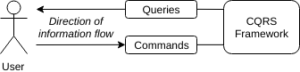

### CQRS

Command Query Responsibility Segregation (CQRS) splits with standard software development by using separate
write and read models an application object. This allows us to create views, or queries, that more accurately model 
our business environment.

> We define "standard application" here as a generic webapp commonly used to provide backend services in business applications.

In standard applications, the domain modeling tends to reflect how the application objects are stored in an RDBMS. 
Updates generally involve loading the object(s) from a set of tables via a JOIN operation, making the requisite 
modifications, and persisting the updated object(s). 

Read operations are usually accomplished via the same load operation or from a view based on the same database tables.
This requires us to make a compromise between our read and write models.

> One of the primary drivers in using CQRS is to remove the compromises between read and write models.

### CQRS basics

When using CQRS we divide our application into two parts: command processors and queries. Users interact to modify the 
system by sending commands but receive no information back. When a user interacts with the query side of our 
application they receive information but there is a guarantee that no changes will be made.

A number of strategies have been devised for decoupling the command and query side of applications. The most 
successful among them is communication across this divide via events. This approach leverages the benefits of a reactive 
architecture as well as providing an opportunity to use event sourcing.
