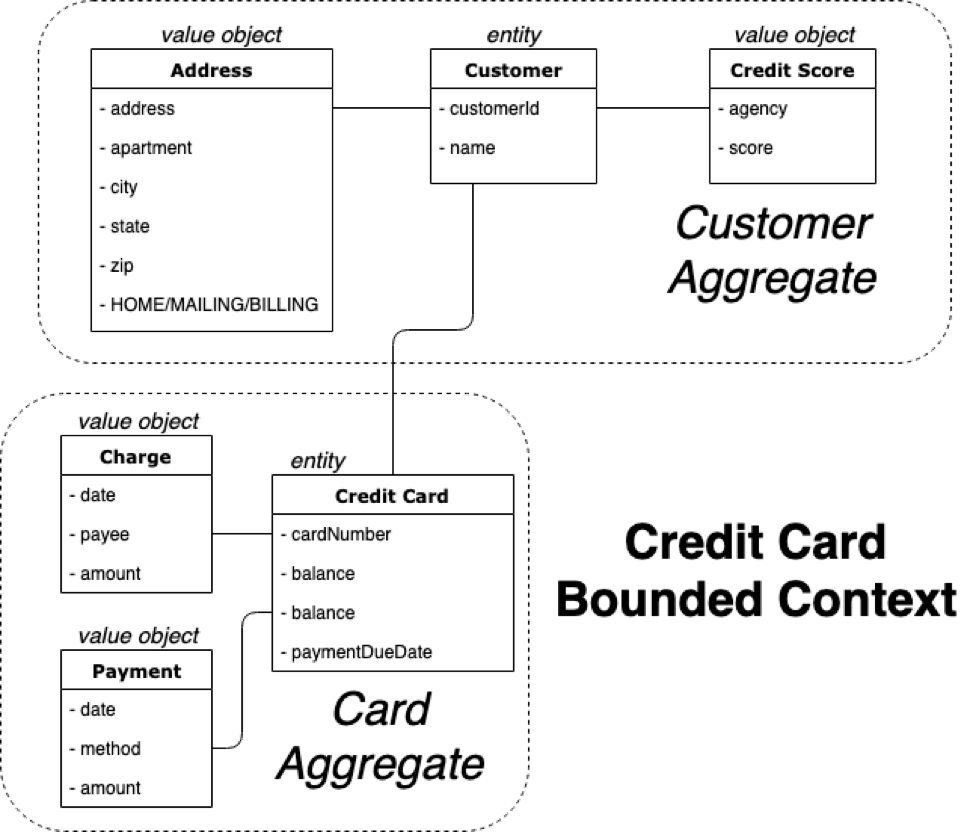
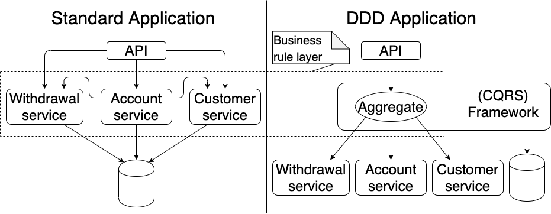

### Domain Driven Design

The intellectual backing for both of these patterns is provided by Domain Driven Design (DDD), which is an approach to 
building software that focuses on building a better business model. The field of DDD is expansive, but one of its core
concepts is the Aggregate.

### Some terminology 

But first, in DDD all objects are broken down into two groups:

 - entities - objects with a unique identity, and usually with state (e.g., a person). 
 - value objects - immutable objects that are constructed when needed and discarded when no longer valuable (e.g., a 
 person's age).
 
We use a combination of these components to form an 'aggregate'. An aggregate is a collection of related entities and value objects. 
An aggregate always has a root entity that forms the basis of this grouping. 

For example, a `CreditCard` aggregate might be composed of:

- the credit card account entity itself - _entity_
- a list of charges - _value objects_
- a payment history - _value objects_

### An example bounded context

The above topics are encapsulated within a [bounded context](https://martinfowler.com/bliki/BoundedContext.html),
an important topic, but outside the scope of this book. An example of a bounded context with multiple aggregates is
below.

### More restrictions

Domain Driven Design requires that Aggregates are only modified as a whole. This means we cannot
operate on any individual component, such as modifying the balance of a bank account, without loading the entire aggregate.
Think of this as using strong encapsulation in an object-oriented pattern.

This stipulation allows robust, simple testing of the business rules since they are all in one location.
Instead of integration tests spanning multiple application layers we can use simple unit tests to guarantee we meet all
of our business requirements.

The above example compares a standard application to that of an application using domain driven design.
The former uses business logic spread through a number of services that access and modify state data in unknown ways.
In a DDD application all changes to the state data are only made through the aggregate resulting in a highly testable 
set of business rules.

In the diagram a CQRS framework is implied, but any DDD framework should promote the same level of flexibility.

### Further reading
Domain Driven Design is a topic far too large to discuss in any detail here. Some additional resources:
- [Ubiquitous language](https://martinfowler.com/bliki/UbiquitousLanguage.html)
- [The Blue Book](https://www.amazon.com/Domain-Driven-Design-Tackling-Complexity-Software-ebook/dp/B00794TAUG) - the 
original text on DDD by Eric Evans
- [The Red Book](https://www.amazon.com/Implementing-Domain-Driven-Design-Vaughn-Vernon-ebook/dp/B00BCLEBN8) - a book 
refined from years of experience with DDD